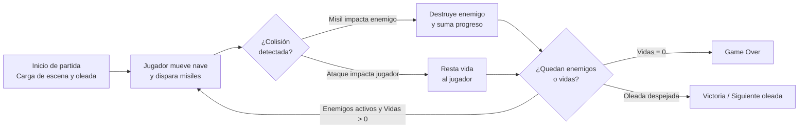

<div align="center">

# 🚀 Space Invaders 2

### Remake 2D de Acción Arcade Desarrollado en Unity y C#

[](https://unity.com)
[](https://learn.microsoft.com/es-es/dotnet/csharp/)
[]()
[]()

</div>

---

## 📋 Descripción del proyecto

**Space Invaders 2** es un videojuego 2D de acción arcade desarrollado con **Unity** y programado íntegramente en **C#**, inspirado en el clásico histórico de los años 80. En el juego, el usuario toma el control de una nave espacial cuya misión es defender la Tierra de oleadas continuas de invasores alienígenas, disparando misiles, esquivando ataques enemigos y sobreviviendo el mayor tiempo posible.

El proyecto nació como una primera incursión práctica en el desarrollo de videojuegos, diseñada para consolidar los fundamentos del motor Unity, el ciclo de vida de los objetos en escena (`GameObjects`) y la programación orientada a eventos y componentes en tiempo real.

## 🎯 El objetivo del proyecto

El desarrollo de un videojuego arcade exige resolver problemas muy distintos a los del software tradicional: control de físicas en tiempo real, instanciación y destrucción constante de objetos en memoria, detección precisa de impactos a 60 cuadros por segundo y retroalimentación inmediata al jugador.

**Space Invaders 2** aborda estos desafíos estructurando la lógica del juego en **componentes modulares e independientes**, donde el control del jugador, el comportamiento de las formaciones enemigas, la física de los proyectiles y el gestor del estado de la partida interactúan de manera limpia y predecible.

## ✨ Características principales

### 🎮 Módulo de Control del Jugador
- Movimiento horizontal fluido de la nave defensora con restricción de límites dentro de la pantalla de juego.
- Respuesta inmediata a los comandos de entrada (*Input System*) para maniobras de evasión frente al fuego enemigo.

### 💥 Sistema de Disparo y Proyectiles
- Instanciación dinámica de misiles desde la posición de la nave mediante el uso de **Prefabs**.
- Control de cadencia de tiro (*cooldown*) y limpieza automática de proyectiles fuera de cámara para optimizar el uso de memoria.

### 👾 Gestión de Enemigos y Oleadas
- Desplazamiento coordinado de escuadrones enemigos en el espacio 2D.
- Lógica de ataque adversario y escalado del desafío a medida que avanza la partida.

### 🛡️ Física de Colisiones y Lógica de Partida
- Detección precisa de impactos entre proyectiles, naves enemigas y el jugador mediante `Collider2D` y `Rigidbody2D`.
- **Sistema de supervivencia:** Control de puntos de vida del jugador, actualización del estado de la partida y manejo de condiciones de derrota (*Game Over*) o despeje de oleadas.

## 🏗️ Arquitectura y stack tecnológico

El proyecto utiliza la arquitectura basada en componentes (**Component-Based Architecture**) propia de Unity, separando el comportamiento en scripts de C# especializados:

| Capa | Tecnología | Uso |
|---|---|---|
| Motor gráfico | **Unity Engine** | Renderizado 2D, bucle principal de juego (*Game Loop*), sistema de físicas y escenas |
| Lógica de juego | **C# (`MonoBehaviour`)** | Scripts de movimiento, instanciación de proyectiles, IA enemiga y reglas de partida |
| Sistema de Físicas | **Unity Physics 2D** | Detección de colisiones (`OnTriggerEnter2D` / `OnCollisionEnter2D`) y trayectorias |
| Gestión de Entidades | **Unity Prefabs** | Plantillas reutilizables para naves, enemigos y proyectiles |
| Control de versiones | **Git** + **GitHub** | Versionado de escenas, scripts y configuraciones del proyecto |

### Decisiones de diseño destacadas

- **Uso intensivo de Prefabs:** Tanto los proyectiles como las unidades enemigas están desacoplados en *Prefabs* reutilizables, permitiendo instanciar oleadas completas o modificar atributos globales desde un único recurso.
- **Separación de responsabilidades por Script:** Cada entidad (jugador, proyectil, enemigo, controlador de juego) posee su propio script en C#, evitando clases monolíticas y facilitando la depuración desde el Inspector de Unity.
- **Gestión eficiente del ciclo de vida:** Los proyectiles que impactan o abandonan el área visible son destruidos automáticamente para mantener estable el rendimiento de la escena.

## 📁 Estructura del proyecto

```text
Space-Invaders-2/
├── Assets/
│   ├── Scenes/                 # Escenas del juego (Menú / Nivel principal)
│   ├── Scripts/                # Lógica en C# (Player, Projectile, Enemy, GameManager)
│   ├── Prefabs/                # Objetos preconfigurados (Nave, Enemigos, Misiles)
│   ├── Sprites/                # Recursos gráficos 2D, fondos y elementos visuales
│   └── Audio/                  # Efectos de sonido y ambientación arcade
├── Packages/                   # Manifiesto de dependencias nativas de Unity
├── ProjectSettings/            # Configuración de físicas 2D, inputs, tags y capas
└── README.md                   # Documentación del proyecto
```
## 🚀 Instalación y puesta en marcha
Requisitos previos
Unity Hub instalado

Unity Editor (versión compatible con el proyecto, recomendada rama LTS)

Visual Studio o VS Code con soporte para C# y extensión de Unity (opcional, para editar scripts)

Pasos
Bash
### 1. Clonar el repositorio en tu máquina local
git clone [https://github.com/Scomes02/Space-Invaders-2.git](https://github.com/Scomes02/Space-Invaders-2.git)
cd Space-Invaders-2
Para abrir y ejecutar el proyecto en tu entorno:

Abrí Unity Hub y hacé clic en el botón Add -> Add project from disk.

Seleccioná la carpeta raíz Space-Invaders-2 recién clonada.

Unity Hub detectará automáticamente la versión del motor requerida; abrilo haciendo clic sobre el nombre del proyecto.

Dentro del Unity Editor, dirigite a la carpeta Assets/Scenes/ y abrí la escena principal del juego.

Presioná el botón Play (▶) en la barra superior del editor para probar el juego en tiempo real, o dirigite a File > Build Settings para compilar un ejecutable independiente (.exe).

🧩 Flujo del sistema


### 👤 Autor
**Santiago Comes** 
- 💻 GitHub: [Scomes02](https://github.com/Scomes02)
- 💼 LinkedIn: [Santiago Comes](https://www.linkedin.com/in/santiago-comes)

📄 Licencia
Proyecto desarrollado con fines educativos y de portafolio para el aprendizaje práctico de arquitectura de videojuegos en Unity y programación en C#.
